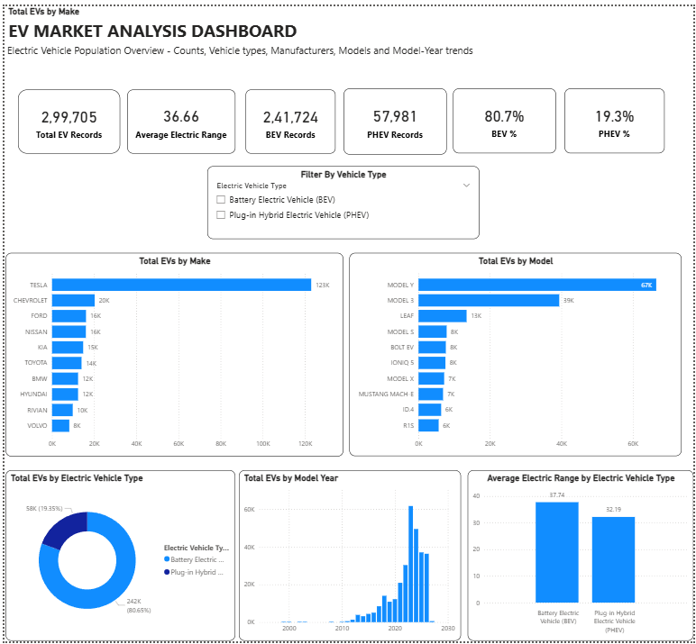
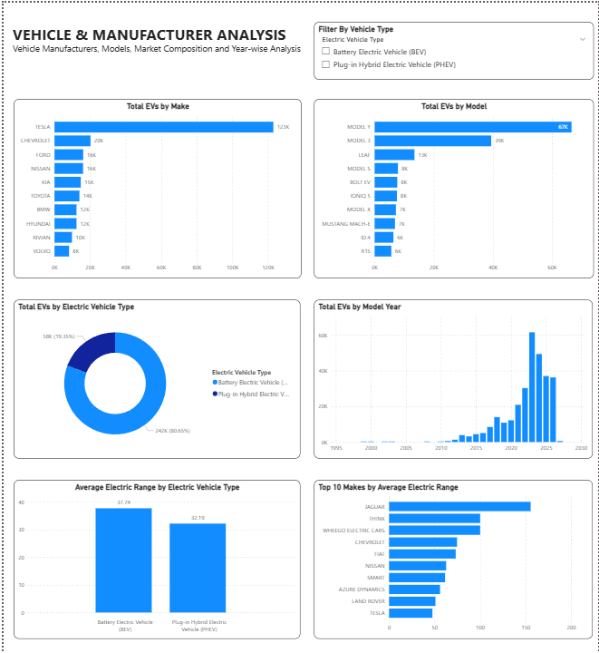
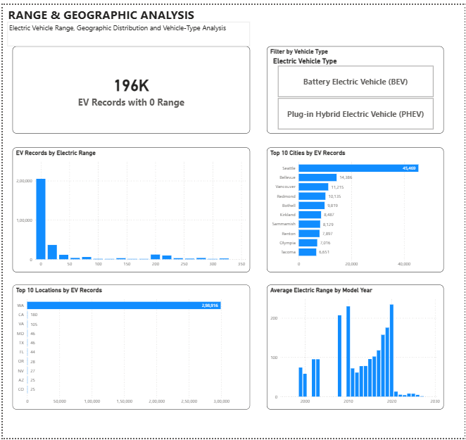

# EV Market Analysis Dashboard

An interactive Power BI dashboard analyzing electric vehicle (EV) data to identify trends across manufacturers, vehicle models, EV types, model years, and electric driving range.

## Project Overview

This project analyzes a dataset containing **299,705 electric vehicle records** and uses Power BI to transform the raw data into an interactive business intelligence dashboard.

The project focuses on understanding the EV market through manufacturer performance, popular vehicle models, vehicle type distribution, model-year trends, and electric range.

## Project Objective

The objective of this project was to analyze electric vehicle population data and identify patterns across manufacturers, vehicle models, vehicle types, model years, electric range, and geographic locations.

The analysis uses Power BI to clean, transform, calculate, and visualize the data through an interactive multi-page dashboard, helping users explore EV market composition and identify key trends and patterns.

## Tools & Technologies

- **Power BI**
- **Power Query**
- **DAX**
- **Data Modeling**
- **Data Cleaning & Transformation**
- **Data Visualization**

## Dataset

The dataset contains electric vehicle population records with fields covering vehicle identity, location, vehicle type, model year, manufacturer, model, and electric range. Representative fields include:

- VIN (1-10)
- Country
- City
- State
- Postal Code
- Model Year
- Make
- Model
- Electric Vehicle Type
- Clean Alternative Fuel Vehicle (CAFV) eligibility
- Electric Range

**Total records:** 299,705

**Source:** [Washington State Electric Vehicle Population Data](https://catalog.data.gov/dataset/electric-vehicle-population-data)

## Data Preparation

The dataset was cleaned and transformed using **Power Query** before building the dashboard.

The preparation process included:
- Reviewing data quality using Power Query profiling
- Removing the unnecessary VIN (1-10) column
- Trimming whitespace from relevant text fields
- Converting identifier and geographic-code fields to appropriate data types
- Reviewing missing and zero-value records
- Retaining zero-range records for separate analysis rather than automatically deleting them
- Creating electric-range bins for distribution analysis
- Preparing the cleaned dataset for analysis and visualization

## Project Workflow

The project followed a structured data analytics workflow:

1. **Data Collection** — Obtained the Electric Vehicle Population dataset from the official Data.gov source.
2. **Data Cleaning** — Used Power Query to inspect data quality, remove unnecessary fields, clean text values, and correct data types.
3. **Data Preparation** — Prepared the cleaned dataset for analysis and created electric-range bins for distribution analysis.
4. **DAX Analysis** — Created reusable measures for EV counts, vehicle-type distribution, average range, and zero-range records.
5. **Dashboard Development** — Built a three-page interactive Power BI dashboard using KPI cards, charts, slicers, and analytical visuals.
6. **Insight Generation** — Analyzed manufacturer concentration, popular models, model-year distribution, geographic patterns, vehicle-type composition, and electric range.

## Dashboard Analysis

## Dashboard Structure

The Power BI report is organized into three analytical pages:

### 1. Executive Dashboard

Provides a high-level overview of the EV population, including:

- Total EV records
- Average electric range
- BEV and PHEV composition
- Leading manufacturers and models
- Model-year trends
- Average electric range by vehicle type

### 2. Vehicle & Manufacturer Analysis

Focuses on manufacturer and vehicle-level analysis, including:

- Top manufacturers by EV records
- Top EV models
- EV type distribution
- EV records by model year
- Average electric range by vehicle type
- Top manufacturers by average recorded electric range

### 3. Range & Geographic Analysis

Focuses on electric-range and geographic patterns, including:

- Electric-range distribution
- Top locations by EV records
- Top cities by EV records
- Average electric range by model year
- Records with zero recorded electric range

## Dashboard Screenshots

### Executive Dashboard

### Vehicle & Manufacturer Analysis

### Range & Geographic Analysis

## Key Analysis

### EV Type Distribution

The dataset contains two major electric vehicle categories:

- **Battery Electric Vehicles (BEV):** 241,724 records
- **Plug-in Hybrid Electric Vehicles (PHEV):** 57,981 records

BEVs represent approximately **80.7%** of the dataset, while PHEVs represent approximately **19.3%**.

### Top Manufacturers

The leading manufacturers by number of EV records include:

1. Tesla — 122,981
2. Chevrolet — 20,236
3. Ford — 16,118
4. Nissan — 16,053
5. Kia — 14,776

Tesla accounts for approximately **41.0%** of all observed EV records in the dataset.

### Top EV Models

The leading models include:

1. Tesla Model Y — 66,545
2. Tesla Model 3 — 39,391
3. Nissan Leaf — 13,453
4. Tesla Model S — 7,873
5. Chevrolet Bolt EV — 7,642

Tesla's Model Y and Model 3 together account for approximately **35.3%** of all observed EV records.

### Model-Year Distribution

Model year **2023** has the highest number of records, with **61,595 records**, representing approximately **20.6%** of the dataset.

This represents the distribution of model years in the dataset and should not be interpreted as annual EV sales or adoption.

### Geographic Distribution

The dataset is heavily concentrated in Washington, which accounts for approximately **99.7%** of all records.

**Seattle** is the leading city, with **45,469 EV records**, representing approximately **15.2%** of the total observed EV population.

### Electric Range Analysis

The average recorded electric range is:

- **BEV:** 37.74 miles
- **PHEV:** 32.19 miles

BEVs therefore have an approximately **5.55-mile higher recorded average range** than PHEVs.

### Zero-Range Records

A total of **196,232 records**, approximately **65.5%** of the dataset, have a recorded electric range of zero.

These zero-range records are concentrated entirely within the BEV category. They were retained in the analysis rather than automatically removed and were investigated separately.

### Model-Year Range Pattern

The highest average recorded electric range occurs for **model year 2020**, at approximately **234.4 miles**.

This represents an observed pattern in the dataset and should not be interpreted as a general statement about the longest-range EVs available in the market.

## DAX & Power BI

DAX measures were created to support reusable and interactive dashboard calculations.

Key measures include:

- **Total EVs** — total number of EV records
- **Average Electric Range** — average recorded electric range
- **BEV Count** — number of Battery Electric Vehicle records
- **PHEV Count** — number of Plug-in Hybrid Electric Vehicle records
- **BEV %** — percentage of records represented by BEVs
- **PHEV %** — percentage of records represented by PHEVs
- **Zero Range EVs** — number of records with an electric range of zero

These measures were used across KPI cards, charts, and interactive filters throughout the report.

The dashboard was designed so that the measures respond dynamically to the selected filter context, allowing users to explore the EV population from different perspectives.

## Limitations

- **Population data, not sales data:** The dataset represents an EV population/registration-style dataset, so record counts should not be interpreted as direct vehicle sales or annual sales volumes.

- **Model year is not registration year:** Model-year distribution should not be interpreted as yearly EV adoption or sales trends.

- **Geographic concentration:** Approximately 99.7% of the records are from Washington, so comparisons involving other locations are based on much smaller samples.

- **Zero-range records:** Approximately 65.5% of records have a recorded electric range of zero. These records were retained rather than automatically removed, but they have a substantial effect on range-related calculations.

- **No causal analysis:** The dashboard identifies patterns and distributions but does not determine why a particular manufacturer, model, year, or location has a particular result.

## Project Outcome

The final Power BI report transforms a large EV population dataset into an interactive three-page analytical dashboard.

The project demonstrates practical experience in:

- Data cleaning and transformation using Power Query
- Data modeling and preparation in Power BI
- Creating reusable analytical measures using DAX
- Building interactive dashboards and visualizations
- Analyzing categorical, temporal, geographic, and range-related patterns
- Communicating data-driven findings and limitations

The dashboard enables users to explore EV manufacturers, models, vehicle types, model years, electric range, and geographic distribution through interactive visuals and filters.

## Author

**Atharva Bali**

- LinkedIn: [Atharva Bali](https://www.linkedin.com/in/atharva-bali-ab7551326/)
- GitHub: [athy30](https://github.com/athy30)
